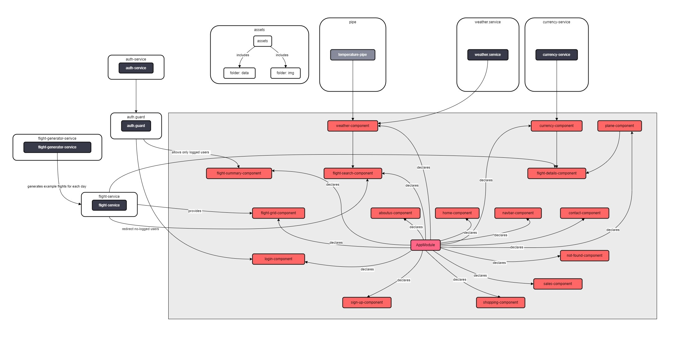

# NOVO Air Flight
Welcome to the NOVO Air Flight reservation system! This Angular 15.2.4-based application allows users to search and book flights to various destinations. The application integrates with Bootstrap, Font Awesome, OpenWeather API, and NBP API to provide a seamless user experience.

##### Live demo: https://akrzeminska.github.io/flight_booking

## Table of Contents
* [Features](#features)
* [Technologies Used](#technologies-used)
* [Roadmap](#roadmap)
* [Installation](#installation)
* [Credits](#credits)
* [Author](#author)

## The building blocks of an application

## Features
* Search one-way flights between three predefined cities.
* Flights are scheduled once daily.
* Choose flight dates from today up to 6 months in advance.
* Display current time, date, and weather for the user's location on the search panel.
* Select the number of passengers and preferred class during flight search.
* View available flights that match the search criteria, including the number of available seats.
* Proceed to the details page to select seats on the airplane layout and choose luggage options.
* Some seats are pre-reserved and unavailable for selection.
* Calculate the ticket cost in PLN, EUR, and USD using the NBP API for currency exchange rates.
* After confirmation, users are redirected to the login panel.
* Once logged in, users can access their ticket with detailed reservation information.

## Technologies Used
This app was built using:

* HTML
* Bootstrap
* CSS/SCSS
* Typescript
* Angular 15.2.4
* RxJS
* Node.js
* NPM


## Roadmap
The application is under active development, and the following features are planned for future releases:

* Payment module integration for secure online payments.
* Full responsive design (RWD) for the application.
* User registration functionality.
* Weather widget integration for the destination location.
* Expansion of airplane templates based on selected destinations.
* Addition of a promotional code field in the details tab to apply available discounts from the sales section.
* Completion of the contact and about us sections.
* Expansion of seat classes on the airplane.
* We are committed to continuously improving the application to provide an enhanced flight reservation experience.

## Installation
To run the NOVO Air Flight application locally, follow these steps:

- Clone the repository: ```git clone https://github.com/akrzeminska/flight_booking.git```

- Navigate to the project directory: ```cd flight_booking```

- Install the required dependencies: ```npm install```

- Start the development server: ```ng serve```

- Open your browser and access the application at ```http://localhost:4200```

## Credits
This application was built using the following resources:

- Icons from Font Awesome
- Fonts from Google Fonts
- Weather API provided by OpenWeather
- Currency API provided by NBP
- Graphics from Pixabay
## Author
Created by _Adelina Krzemińska_
